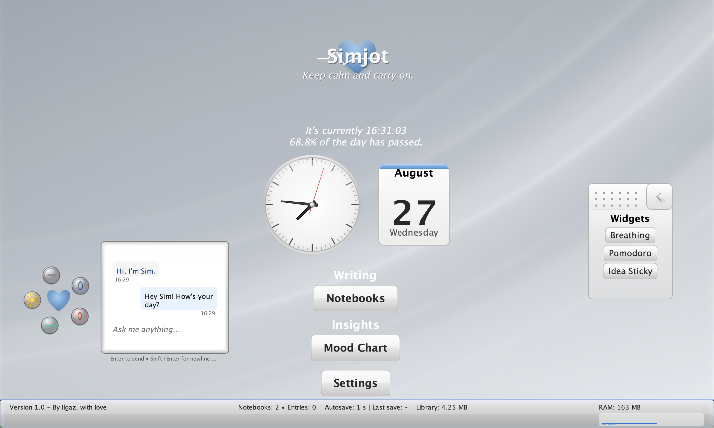
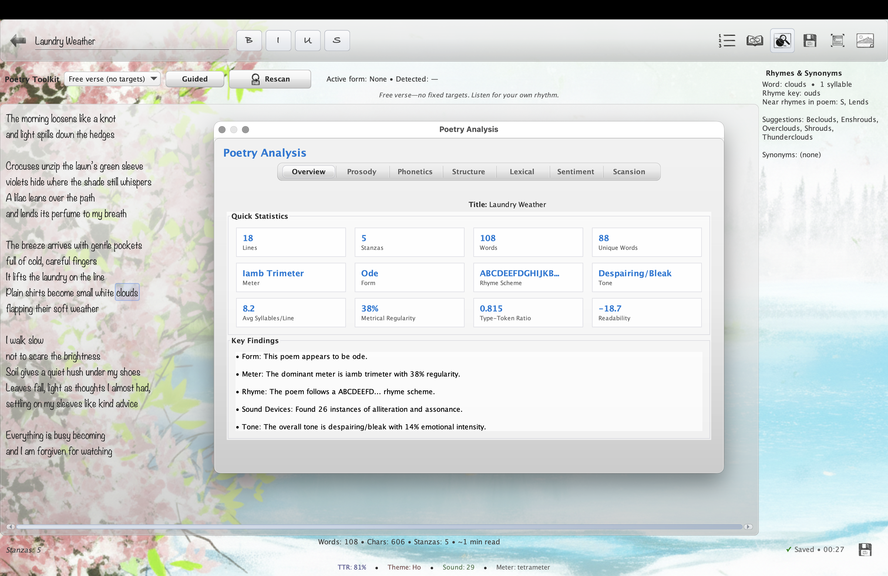
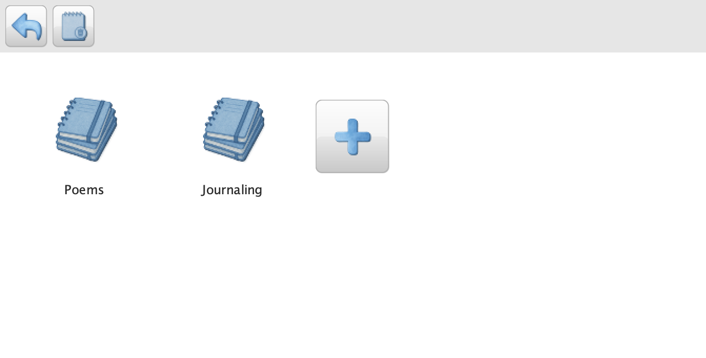
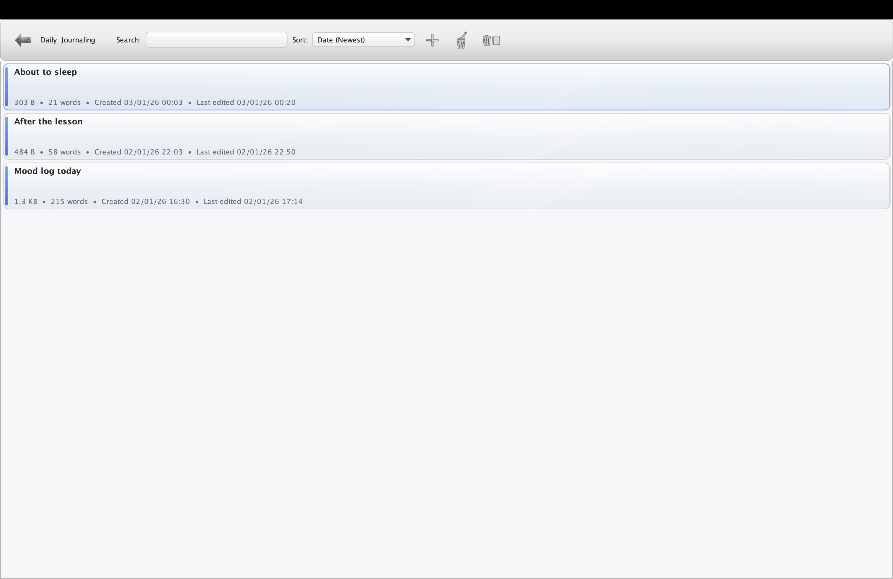
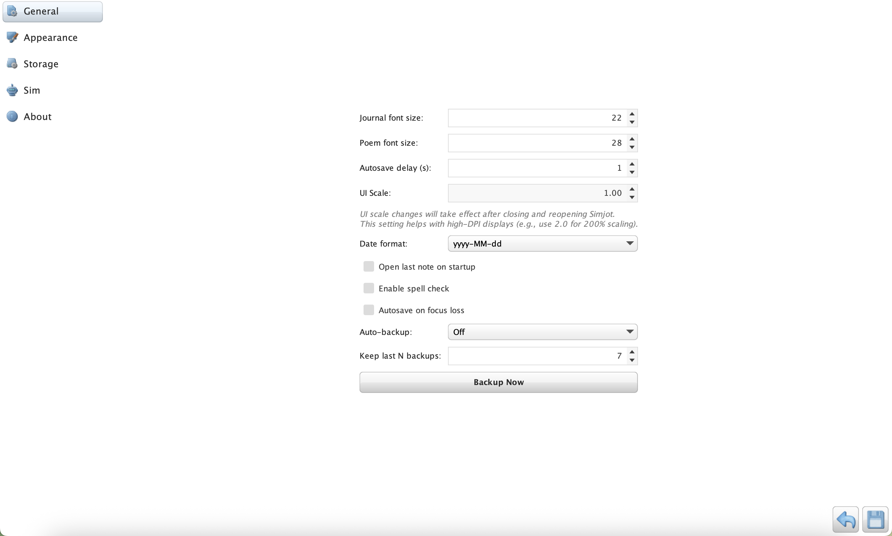
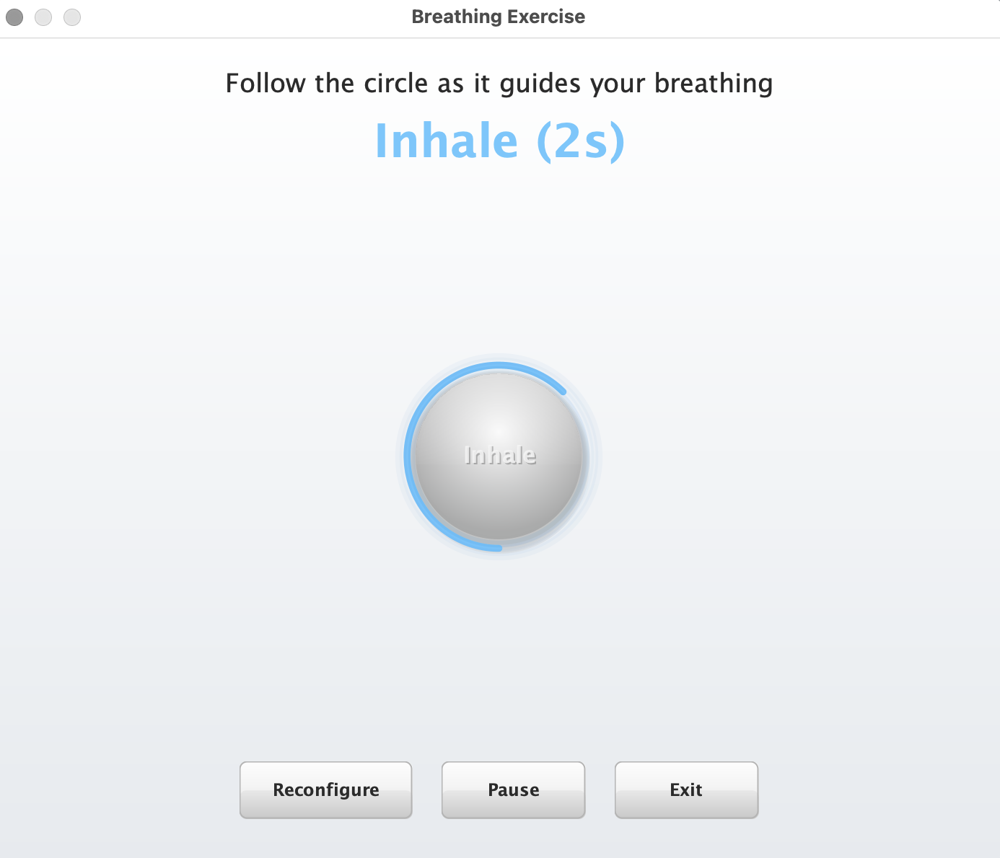
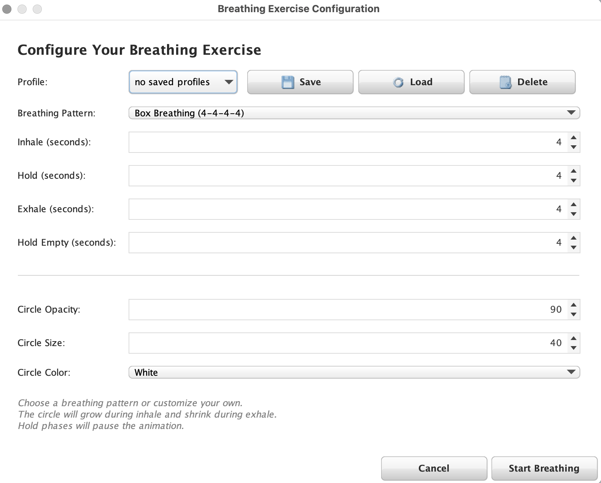

#  Simjot

[](https://www.oracle.com/java/)
[](https://openjfx.io/)
[](LICENSE)
[](https://github.com/S1mplector/Simp3/releases)


A lightweight, feature-rich and highly personalizable journaling and poetry workspace application built with Java Swing, designed to help you capture your thoughts, express creativity, and track your well-being in an elegant digital environment.

## Features

### **Multi-Format Content Creation**
- **Journal Entries**: Traditional diary-style entries with mood tracking and rich formatting
- **Poetry Writing**: Dedicated poetry editor with metering and rhyme tips. 

### **Mood & Wellness Tracking**
- **Interactive mood slider** with visual feedback (0-100 scale)
- **Mood chart visualization** with date range filtering (7 days, 30 days, all time)
- **Automatic mood logging** integrated with journal entries
- **Visual mood trends** to track emotional patterns over time

### **Organization & Management**
- **Notebook system** with different types (Journal, Poetry)
- **File browser** with entry previews and word counts
- **Auto-save functionality** with timestamp-based filenames
- **Search and filter** capabilities across all content

### **User Experience**
- **Modern UI design** with smooth animations and transitions
- **Customizable backgrounds** and themes
- **Intuitive navigation** with card-based interface
- **Tutorial system** for new users
- **Settings panel** for personalization
- **Sound effects** and visual feedback

## Screenshots

Below are a few highlights from the current UI. More images live in `Simjot/Simjot/docs/images`.

- **Main Interface**

  

- **Journaling Interface**

  

- **Poetry Workspace**

  

- **Notebook Manager**

  

- **Entry Manager**

  

- **Settings**

  

- **Breathing Exercise**

  
  
  

## Quick Start

### Prerequisites
- **Java 17 or higher** installed on your system
- **JDK 17 or higher** for building the project

### Installation & Build
1. **Clone or download** the project to your local machine
2. **Open PowerShell or Command Prompt** in the project directory
3. **Run the build script**:
   ```cmd
   package_simjournal.bat
   ```

The build process will:
- Compile all Java sources
- Create a modular JAR file
- Generate a standalone application in the `dist/` folder

### Running the Application

After building, you can run Simjot in two ways:

**Option 1: Native Executable (Recommended)**
```
dist/Simjot/Simjot.exe
```

**Option 2: JAR File**
```cmd
java -jar Simjot.jar
```
This option runs on Windows/macOS/Linux as long as Java 17+ is installed.

## Usage Guide

### First Launch
On first startup, Simjot will prompt you to:
1. **Choose a journal folder** where all your content will be stored
2. **Take an optional tutorial** to learn the interface
3. **Set up your preferences** in the settings panel

### Creating Content

#### **Journal Entries**
1. Click "New Entry" from the main menu
2. Select your mood using the interactive slider
3. Write your thoughts in the rich text editor
4. Entries are automatically saved with timestamps

#### **Poetry Writing**
1. Select "New Poem" for the dedicated poetry interface
2. Choose from multiple fonts (Serif, Georgia, Verdana, Cursive)
3. Use the "Inspire Me" button for creative prompts
4. Track stanza count in real-time

### Organization

#### **Notebooks**
- Create separate notebooks for different topics or time periods
- Choose notebook types: Journal, or Poetry
- Each notebook maintains its own file structure

#### **Viewing Content**
- Use "View Entries" to browse all your created content
- Filter by type (entries, poems, notes)
- Preview content before opening
- See word counts and creation dates

## Project Structure

```
Simjot/
├── src/
│   ├── main/
│   │   ├── core/               # Domain models, services, poetry, sim, exports
│   │   ├── infrastructure/     # Persistence/adapters/utilities
│   │   ├── resources/          # App resources (if any)
│   │   └── ui/                 # Swing UI (features, panels, widgets, etc.)
│   └── module-info.java        # Java module definition
├── tests/                      # Unit tests (mirrors main packages)
├── docs/                       # Project documentation & screenshots
├── build/                      # Compiled classes and build artifacts
└── sources.txt                 # Source file listing (build helper)
```

## Technical Details

### Architecture
- **Modular Java application** using Java Platform Module System
- **Swing-based UI** with custom Look & Feel
- **CardLayout navigation** for smooth panel transitions
- **Observer pattern** for UI updates and state management
- **File-based persistence** with custom serialization

### Technologies Used
- **Java 17+** with Project Jigsaw (modular system)
- **Java Swing** for cross-platform GUI
- **Java 2D Graphics** for drawing and image processing
- **Custom file formats** for data persistence
- **Built-in audio support** for sound effects

### File Formats
- **Journal entries**: `.note` files with metadata
- **Poems**: `.poem` files with title and content
- **Settings**: Configuration files in user directory

## Customization

### Themes & Appearance
- Multiple background options for different writing modes
- Customizable font sizes for journal entries and notes
- Adjustable mood tracking visualization
- Personalized color schemes for drawing tools

### Settings Options
- Default brush sizes and colors
- Auto-save intervals
- Thumbnail generation preferences
- Audio feedback controls
- Tutorial and tip visibility

## Contributing

This application wasn't meant to be commercially available, it's a personal journaling application, but if you'd like to contribute:

1. **Fork the repository**
2. **Create a feature branch**: `git checkout -b feature/amazing-feature`
3. **Commit your changes**: `git commit -m 'Add amazing feature'`
4. **Push to the branch**: `git push origin feature/amazing-feature`
5. **Open a Pull Request**

### Development Setup
1. **Ensure Java 17+ is installed**
2. **Import the project** into your preferred IDE
3. **Run the main class**: `main.ui.JournalApp`
4. **Make changes** and test thoroughly


### Common Issues
- **Application won't start**: Ensure Java 17+ is installed and in your PATH
- **Drawing performance**: Close unused applications for better graphics performance
- **File not found errors**: Check that the journal folder path is accessible

### Support
For technical issues or feature requests, please check the project documentation or create an issue in the project repository.

## Acknowledgments

---

*Happy Journaling!*
